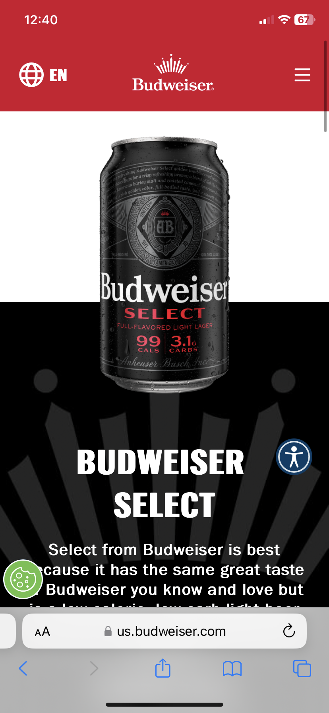

# Procesverslag
Markdown is een simpele manier om HTML te schrijven.  
Markdown cheat cheet: [Hulp bij het schrijven van Markdown](https://github.com/adam-p/markdown-here/wiki/Markdown-Cheatsheet).

Nb. De standaardstructuur en de spartaanse opmaak van de README.md zijn helemaal prima. Het gaat om de inhoud van je procesverslag. Besteedt de tijd voor pracht en praal aan je website.

Nb. Door *open* toe te voegen aan een *details* element kun je deze standaard open zetten. Fijn om dat steeds voor de relevante stuk(ken) te doen.

## Jij

  
uitwerken voor kick-off werkgroep

  ### Auteur:
  Jim Struikenkamp

  #### Je startniveau: 
  Blauw

  #### Je focus:
  Surface plane

## Je website

  
uitwerken voor kick-off werkgroep

  ### Je opdracht:
  https://us.budweiser.com/   
  #### Screenshot(s) van de eerste pagina (small screen): 
  Home budweiser
  

  #### Screenshot(s) van de tweede pagina (small screen):
  Budweiser our beer
  
 

## Toegankelijkheidstest 1/2 (week 1)

  
uitwerken na test in 2e werkgroep

  ### Bevindingen
  Test toegankelijkheid:
  In werkgroep 2 hebben we een toegankelijkheidstest gedaan, dit hebben we gedaan aan de hand van een ballon en een beperkte bril.

  Concentratietest(Budweiser):
  De ballon moet nabootsen hoe het is om met een concentratiestoornis de site te bezoeken. Ik gaf Niels de taak om een muts toe te voegen aan de winkelwagen, dit is normaal gesproken een makkelijke taak. Niels had zonder de ballon in een tijd van 15 seconden de muts in de winkelwagen gedaan, met de ballon was zijn concentratie een stuk minder en deed hij er 2x zo lang over. Zijn conclusie over de concentratiestoornis is dat het lastig is om te focussen en het fijn is als er weinig tekst en afleiding is, zodat hij snel zijn doel kan bereiken.

  Concentratietest(gucci):
  Niels heeft de site van Gucci gekozen, deze site hebben we ook getest op de toegankelijkheid aan de hand van een concentratietest.
  Ik voer deze test uit en Niels gaf mij de taak om een jas te vinden en deze in mijn winkelwagen te plaatsen. Deze taak is normaalgesproken makkelijk uit te voeren, niks bleek minder waar met de ballon. Ik deed er namelijk 1 minuut en 18 seconden over met een concentratiestoornis en 25 seconden zonder. Doordat ik me veel bezig hield om de ballon hoog te houden vond ik het lastig om op de knoppen te klikken, deze waren vaak erg klein. 

  Zichtbelemmeringstest:
  Na de concentratietest hebben we een bril opgezet die de linker kant van ons zicht belemmert. We hadden eigenlijk dezelfde conclussie, het beperkte ons niet echt in het gebruik van de app, we kregen wel beide vrij snel hoofpijn. Het focuspunt ligt ergens anders, dus het is handig dat alles op de site in een goed contrast staat en alles duidelijk is aangegeven.

  Voorleesfunctie:
  De website heb ik getest om te kijken of het geschikt is voor de voorleesfunctie. Veel zag er goed uit, ik kon redelijk gemakkelijk door de website heen met mijn toetsenbord. Er zijn wel een paar dingen die niet helemaal goed gaan, bijvoorbeeld dat elke keer als je de homepage opent er iets word voorgelezen wat nergens staat. Ik denk persoonlijk dat er iets in de slider staat wat er nooit is uitgehaald. Daarnaast zijn de social media icons omschreven als “links” en bijvoorbeeld niet “instagram icoon link”.

## Breakdownschets (week 1)

  
uitwerken na afloop 3e werkgroep

  ### de hele pagina: 
  

  ### dynamisch deel (bijv menu): 
  

  ### wellicht nog een dynamisch deel (bijv filter): 
  

 

## Voortgang 1 (week 2)

  
uitwerken voor 1e voortgang

  ### Stand van zaken
  hier dit ging goed & dit was lastig (neem ook screenshots op van delen van je website en code)

  ### Agenda voor meeting
  samen met je groepje opstellen

  | student 1      | student 2          | student 3    | student 4        |
  | ---            | ---                | ---          | ---              |
  | dit bespreken  | en dit             | en ik dit    | en dan ik dat    |
  | en dat ook nog | dit als er tijd is | nog een punt | dit wil ik zeker |
  | ...            | ...                | ...          | ...              |

  ### Verslag van meeting
  hier na afloop snel de uitkomsten van de meeting vastleggen

  - punt 1
  - punt 2
  - nog een punt
  - ...

## Voortgang 2 (week 3)

  
uitwerken voor 2e voortgang

  ### Stand van zaken
  hier dit ging goed & dit was lastig (neem ook screenshots op van delen van je website en code)

  ### Agenda voor meeting
  samen met je groepje opstellen

  | student 1      | student 2          | student 3    | student 4        |
  | ---            | ---                | ---          | ---              |
  | dit bespreken  | en dit             | en ik dit    | en dan ik dat    |
  | en dat ook nog | dit als er tijd is | nog een punt | dit wil ik zeker |
  | ...            | ...                | ...          | ...              |

  ### Verslag van meeting
  hier na afloop snel de uitkomsten van de meeting vastleggen

  - punt 1
  - punt 2
  - nog een punt
- ...

## Toegankelijkheidstest 2/2 (week 4)

  
uitwerken na test in 9e werkgroep

  ### Bevindingen
  Lijst met je bevindingen die in de test naar voren kwamen (geef ook aan wat er verbeterd is):

## Voortgang 3 (week 4)

  
uitwerken voor 3e voortgang

  ### Stand van zaken
  hier dit ging goed & dit was lastig (neem ook screenshots op van delen van je website en code)

  ### Agenda voor meeting
  samen met je groepje opstellen

  | student 1      | student 2          | student 3    | student 4        |
  | ---            | ---                | ---          | ---              |
  | dit bespreken  | en dit             | en ik dit    | en dan ik dat    |
  | en dat ook nog | dit als er tijd is | nog een punt | dit wil ik zeker |
  | ...            | ...                | ...          | ...              |

  ### Verslag van meeting
  hier na afloop snel de uitkomsten van de meeting vastleggen

  - punt 1
  - punt 2
  - nog een punt
  - ...

## Eindgesprek (week 5)

  
uitwerken voor eindgesprek

  ### Je uitkomst - karakteristiek screenshots:
  

  ### Dit ging goed/Heb ik geleerd: 
  Korte omschrijving met plaatjes

  

  ### Dit was lastig/Is niet gelukt:
  Korte omschrijving met plaatjes

  

## Bronnenlijst

  
continu bijhouden terwijl je werkt

  Nb. Wees specifiek ('css-tricks' als bron is bijv. niet specifiek genoeg). 
  Nb. ChatGpT en andere AI horen er ook bij.
  Nb. Vermeld de bronnen ook in je code.

  1. bron 1
  2. bron 2
  3. ...

